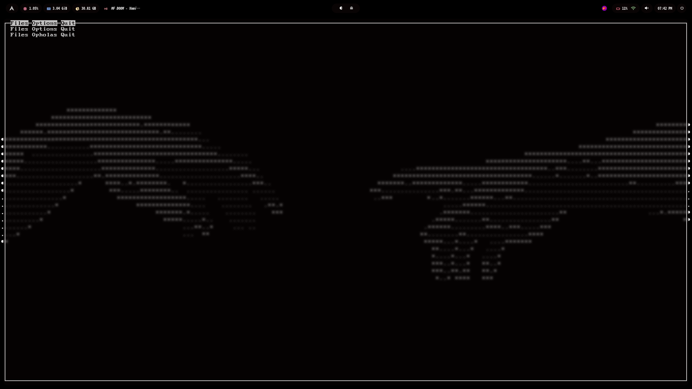

<h3 align="left">
Hi this is My personal project of a comic reader in cbr and cbz format for the Kitty terminal writed on C++ Currently I have started it but it is in a very early stage of development in which the C++ libraries are still being considered. But currently I have made a menu that does nothing yet and I also have made the base of the Archives decompressor made with libarchive. But this is very complex for me because I'm starting in C++ and I am 14 years old also on the end of the README You can find how to compile it and its dependencies
</h3>

<h3 align="left">
The project will be completed in one or two months
</h3>

### How it will work
The reader will work using bit7z as a base to decompress the files to the ram and then print an image using the image protocol of the kitty terminal I'm also currently using the ncurses library to make an interactive menu and the filesystem library to read the files of a directory and string along with fstream to be able to read and write a file where the comic book directories will go

### other
This is a really big project for me, because at first I thought it would be easy for a 14-year-old guy who likes comics and computers and who wanted to learn C++ But I realized that it wasn't and the truth is that I would like to finish it before going back to high school because it is a very interesting project, plus most of the comic readers are paid and ad-supported, so once I finish it for terminal I would like to port it with a graphical interface to Windows and Android, and also, if you read this, thank you very much for seeing my project

### compile libarchive
If you want to try the libarchive program, You can compile it with this command: g++ libarchive-first-attempt.cpp -o program -larchive

### compile menu
If you wan to try my non working menu you can compile it with this command g++ menu.cpp -o program2 -lncurses

### Dependencies:
libarchive, kitty, ncurses and g++ or gcc
